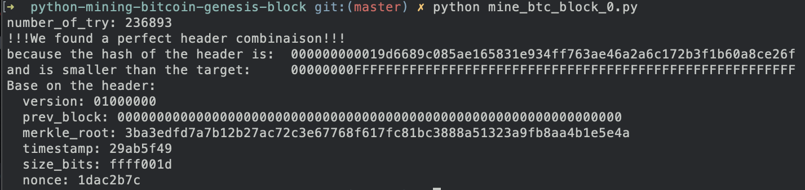

# Bitcoin Mining Genesis Block in Python
A Python implementation of the Bitcoin mining algorithm

This small script is a pseudo-simulation of the Bitcoin Genesis block mining process.

Given the Genesis block's data, this script double-hashes it using SHA-256 and attempts to find a hash less than the Genesis target.

Please note for the academic purpose, all the header is fixed and only the nonce change.
In that example, the nonce start at 2083000000 so we need to increment by one 236893 time to get the magic nonce of 2083236893.
It take approximately 5 second on average computer to find the solution.

In the real circumstance the header has 4 variables that change between the 10 minutes average window. The variables is :  **merkle_root, timestamp, size_bits and nonce**. So the code do not reflect the reality because in that case only the nonce is changing but it's easier to understand and enable to find the same parameter of the first mining block header.

| Variable | circumstance of change |
| ------ | ------ |
| merkle_root | when the new transactions is added to the memory pool, the merkle root is recalculated |
| timestamp | when the second change (the Epoch) |
| size_bits | when the new transactions is added to the memory pool |
| nonce | with the random generator |

## Sample Output

